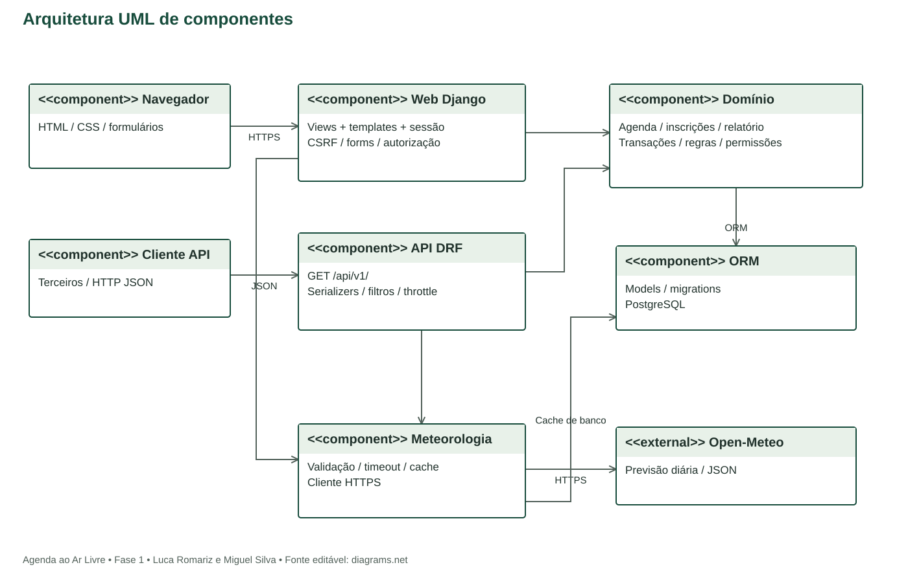

# Arquitetura da aplicação
Agenda ao Ar Livre | Proposta para implementação na fase 2

## 1. Decisão principal
Monólito modular Django com templates renderizados no servidor e uma API REST de leitura em Django REST Framework. Interface e API reutilizam regras e consultas do domínio; a interface não precisa chamar a API pública para realizar escritas. Isso reduz duplicação e evita implementar uma SPA para uma equipe de duas pessoas.

Python 3.12 e Django 5.2 LTS são a linha de base proposta; versão corretiva e versões compatíveis de DRF, psycopg, requests, Gunicorn e WhiteNoise serão fixadas e verificadas ao iniciar a fase 2. PostgreSQL será usado em desenvolvimento e produção para reproduzir bloqueios e concorrência. Não existe aplicação Django implementada nesta entrega.

## 2. Componentes UML

Fonte editável: componentes.drawio. Componentes UML estão marcados com estereótipo component e suas dependências são direcionadas. A Open-Meteo está fora do limite da aplicação.

## 3. Camadas e responsabilidades
| Componente | Responsabilidade |
| --- | --- |
| Navegador / templates | Formulários, catálogo, detalhe, feedback, inscrições e relatório. |
| contas | Usuário customizado AbstractUser com e-mail único; sessão, login e logout. |
| agenda | Models Local, Categoria, Atividade e Inscricao; formulários e views. |
| Serviços de domínio | Publicar, inscrever, cancelar e autorizar sob transações. |
| relatorios | Consultas agregadas restritas ao organizador e exportação CSV. |
| api | Serializers públicos, paginação, filtros, normalização de erros e rotas /api/v1/. |
| meteorologia | Cliente HTTP com host fixo, validação JSON e normalização dos estados. |
| ORM / PostgreSQL | Persistência, chaves, checks, unicidade e bloqueios de linha. |
| Cache | Backend DatabaseCache Django com TTL, incluindo cache negativo breve. |

DatabaseCache usa tabela técnica própria criada pelo Django; não é entidade de negócio. Também existem tabelas técnicas de auth, sessões, permissões, migrations e, se habilitado, admin log. Elas não são omitidas da implantação, apenas separadas do DER de domínio.

## 4. Fluxos de dados
Consulta: navegador -> URL/view -> serviço de consulta -> ORM -> PostgreSQL -> template HTML. API: cliente -> DRF -> mesmo serviço -> serializer com lista explícita de campos -> JSON.

Inscrição: sessão + CSRF -> view -> serviço -> transaction.atomic + select_for_update na atividade -> verificação de início/situação/vagas -> criação ou reativação -> commit -> mensagem. Cancelamentos e edição de capacidade usam o mesmo bloqueio, evitando decisões com contagem antiga.

Previsão: página de detalhe -> serviço meteorológico -> horizonte/cache -> HTTPS Open-Meteo quando necessário -> validação -> cache -> bloco visual. A chamada não ocorre dentro da transação de inscrição. Falhas do provedor não bloqueiam o negócio.

## 5. Organização prevista de código
Usar src/backend/ para manage.py, config/ e apps contas/, agenda/, meteorologia/, relatorios/ e api/. Templates e static ficam no projeto Django. A fase 1 entrega apenas os documentos e protótipos, evitando instruções de execução de código inexistente.

## 6. Autenticação e autorização
Contas são participantes e podem organizar atividades próprias. Dono vem sempre da sessão, nunca de um campo enviado pelo formulário. Querysets protegidos filtram por dono antes da consulta de objeto. Operações POST exigem CSRF. API v1 é exclusivamente GET, pública; não possui endpoints de escrita nem token nesta versão. GET nunca muda inscrições.

Senhas usam mecanismos do Django; USERNAME_FIELD será email no usuário customizado desde a primeira migration. Sessão expira conforme configuração a definir na implementação. Middleware de limitação de login deverá ser configurado e testado; DRF throttle para a API é defesa complementar, não garantia contra ataque distribuído.

## 7. Implantação prevista
Cliente -> HTTPS do provedor -> Gunicorn/Django -> PostgreSQL gerenciado. WhiteNoise serve arquivos estáticos coletados. O backend acessa Open-Meteo por HTTPS de saída. Não há upload de arquivos no escopo.

Provedor e domínio ainda não escolhidos: avaliar suporte a Python/PostgreSQL, custo, persistência, logs e disponibilidade até o fim da avaliação. A escolha ocorrerá no marco M2, sem contratação nesta fase.

DEBUG=False, ALLOWED_HOSTS restrito, CSRF_TRUSTED_ORIGINS com origem HTTPS exata, cookies Secure/HttpOnly conforme tipo e configuração correta do proxy confiável. Credenciais via ambiente; .env não versionado. Backup do banco e restauração de dados fictícios planejados para demonstração.

## 8. Decisões e consequências
- Templates Django: menos ferramentas e deploy único; evolução de interface sem SPA.
- PostgreSQL também local: configuração inicial adicional, mas teste de última vaga reproduz produção.
- API somente leitura: atende consulta por terceiros sem ampliar manutenção e autenticação de API.
- Previsão diária: minimiza interpretação errada de valores horários; interface identifica que o resumo se refere ao dia inteiro.
- Sem Celery/Redis: consulta sob demanda com cache de banco; adequada ao volume acadêmico.

## 9. Segurança e validação planejadas
Testar IDOR entre dois organizadores, CSRF, unicidade, XSS por título, filtros inválidos, exportação CSV com neutralização de células iniciadas por =,+,-,@, concorrência da última vaga e falhas externas. Planejar SAST com Bandit, análise de dependências complementar e DAST com OWASP ZAP apenas em ambiente do grupo. Relatórios e correções serão produzidos na fase 2, sem declarar execução antecipada.
