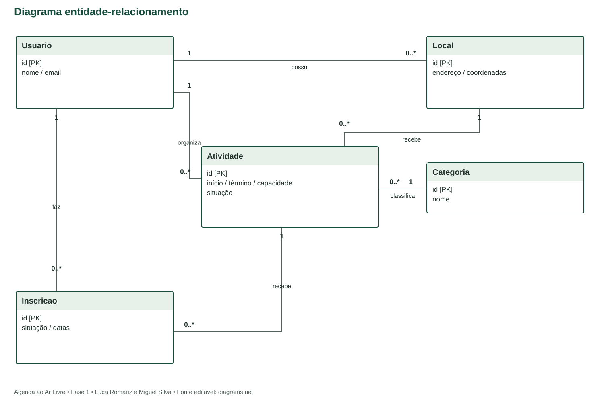

# Modelo entidade-relacionamento
Agenda ao Ar Livre | Domínio de negócio

Fonte editável: diagrama-er.drawio. A notação mostra entidades e cardinalidades mínimo..máximo nas extremidades. Os atributos completos e tipos constam no modelo lógico complementar.

## Entidades e relacionamentos
| Relacionamento | Cardinalidade e significado |
| --- | --- |
| Usuario possui Local | Usuario 1 -> Local 0..*. Cada local tem um dono. |
| Usuario organiza Atividade | Usuario 1 -> Atividade 0..*. Toda atividade tem organizador. |
| Local recebe Atividade | Local 1 -> Atividade 0..*. Toda atividade ocorre em um local. |
| Categoria classifica Atividade | Categoria 1 -> Atividade 0..*. Toda atividade pertence a uma categoria. |
| Usuario faz Inscricao | Usuario 1 -> Inscricao 0..*. Toda inscrição tem participante. |
| Atividade recebe Inscricao | Atividade 1 -> Inscricao 0..*. Toda inscrição se refere a uma atividade. |

O relacionamento N:N entre usuários participantes e atividades é resolvido por Inscricao, que contém situação e datas. O papel organizador pertence à relação de autoria da atividade, não a uma tabela ou perfil exclusivo.

## Normalização
Categorias e locais não são repetidos textualmente em Atividade. Inscricao depende do par usuário/atividade e possui identificador próprio. Não armazenar vagas, taxa de ocupação ou indicadores, pois são derivados. O modelo busca a terceira forma normal. As tabelas técnicas do Django são descritas na arquitetura.
