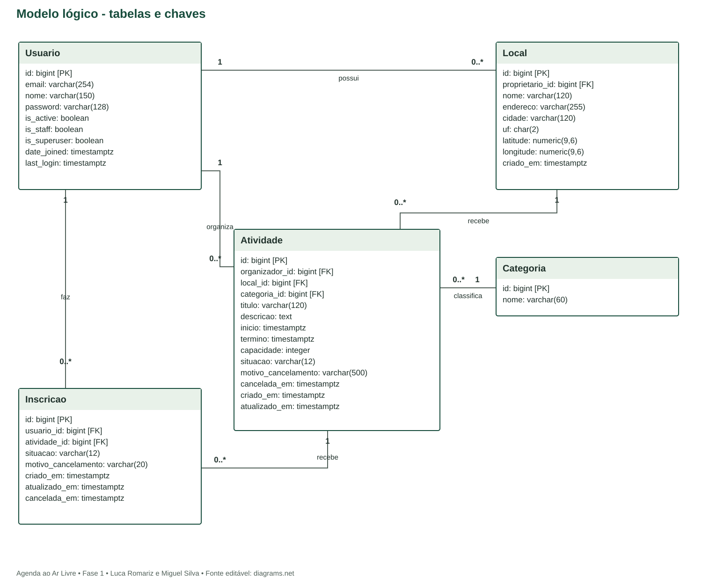

# Modelo lógico e dicionário de dados
Agenda ao Ar Livre | PostgreSQL | Proposta, não migration executada

Fonte editável: modelo-logico.drawio. Fonte estruturada: modelo.json. Todos os campos são NOT NULL, salvo last_login e os campos cancelada_em. Campos de motivo aceitam string vazia somente nos estados sem cancelamento.

## Usuario

| Campo | Tipo | Restrição / significado |
| --- | --- | --- |
| id | bigint | PK; identity |
| email | varchar(254) | UNIQUE; minúsculas; obrigatório |
| nome | varchar(150) | obrigatório |
| password | varchar(128) | hash Django; obrigatório |
| is_active | boolean | default true |
| is_staff | boolean | default false |
| is_superuser | boolean | default false |
| date_joined | timestamptz | obrigatório |
| last_login | timestamptz | pode ser nulo |

## Local

| Campo | Tipo | Restrição / significado |
| --- | --- | --- |
| id | bigint | PK; identity |
| proprietario_id | bigint | FK Usuario; PROTECT |
| nome | varchar(120) | obrigatório |
| endereco | varchar(255) | obrigatório |
| cidade | varchar(120) | obrigatório |
| uf | char(2) | UF brasileira válida |
| latitude | numeric(9,6) | entre -90 e 90 |
| longitude | numeric(9,6) | entre -180 e 180 |
| criado_em | timestamptz | obrigatório |

## Categoria

| Campo | Tipo | Restrição / significado |
| --- | --- | --- |
| id | bigint | PK; identity |
| nome | varchar(60) | UNIQUE; obrigatório |

## Atividade

| Campo | Tipo | Restrição / significado |
| --- | --- | --- |
| id | bigint | PK; identity |
| organizador_id | bigint | FK Usuario; PROTECT |
| local_id | bigint | FK Local; PROTECT |
| categoria_id | bigint | FK Categoria; PROTECT |
| titulo | varchar(120) | obrigatório |
| descricao | text | 10 a 5000 caracteres |
| inicio | timestamptz | obrigatório |
| termino | timestamptz | maior que inicio |
| capacidade | integer | entre 1 e 500 |
| situacao | varchar(12) | rascunho/publicada/cancelada |
| motivo_cancelamento | varchar(500) | vazio salvo se cancelada |
| cancelada_em | timestamptz | nulo salvo se cancelada |
| criado_em | timestamptz | obrigatório |
| atualizado_em | timestamptz | obrigatório |

## Inscricao

| Campo | Tipo | Restrição / significado |
| --- | --- | --- |
| id | bigint | PK; identity |
| usuario_id | bigint | FK Usuario; PROTECT |
| atividade_id | bigint | FK Atividade; PROTECT |
| situacao | varchar(12) | confirmada/cancelada |
| motivo_cancelamento | varchar(20) | vazio/participante/atividade_cancelada |
| criado_em | timestamptz | primeira inscrição |
| atualizado_em | timestamptz | última mudança |
| cancelada_em | timestamptz | nulo se confirmada |

## Restrições complementares
- Usuario: usuário customizado baseado em AbstractUser; remover username/first_name/last_name e usar nome/email. Definir antes da primeira migration. Relações técnicas groups/user_permissions permanecem conforme Django.
- Email: normalizar para minúsculas e impor unicidade de Lower(email) no PostgreSQL; não depender apenas do formulário.
- Inscricao: UNIQUE(usuario_id, atividade_id). Reativação limpa cancelada_em e motivo, preservando criado_em e atualizando atualizado_em.
- Atividade: CHECK termino > inicio, capacidade BETWEEN 1 AND 500 e situação no conjunto permitido. Cancelada exige cancelada_em e motivo com 10 a 500 caracteres; outros estados exigem cancelada_em nulo e motivo vazio.
- Inscricao: CHECK situação permitida; confirmada exige cancelada_em nulo e motivo vazio; cancelada exige data e motivo participante ou atividade_cancelada.
- Local: CHECK latitude e longitude nos intervalos; validar UF contra lista permitida. Validações textuais impedem apenas espaços.
- Todos os FKs usam PROTECT no ORM; não há exclusão em cascata de histórico. O esquema SQL ilustrativo usa ON DELETE RESTRICT.
- Regras entre tabelas (dono do local, capacidade versus contagem, autoinscrição e horários) ficam no serviço transacional, pois CHECK não consulta outras linhas.
- Mesmo dia e início futuro são validados na aplicação com fuso America/Sao_Paulo; timestamps são guardados com consciência de fuso (UTC na aplicação).

## Índices
FKs indexadas pelo Django. Acrescentar Atividade(situacao, inicio, id), Atividade(organizador_id, inicio), Local(cidade), Inscricao(atividade_id, situacao). O índice único do par usuário/atividade auxilia consulta individual. Busca textual inicial com icontains; índice trigram fica fora do escopo até medir necessidade.

## Migrações e dados iniciais
Usar migrations Django como fonte executável na fase 2; o arquivo esquema.sql é referência de domínio, não substitui tabelas técnicas ou migrations. Categorias iniciais: Caminhada, Treino e Encontro, inseridas por data migration. Dados fictícios de demonstração devem ser criados por comando próprio e nunca incluir senhas reais.
