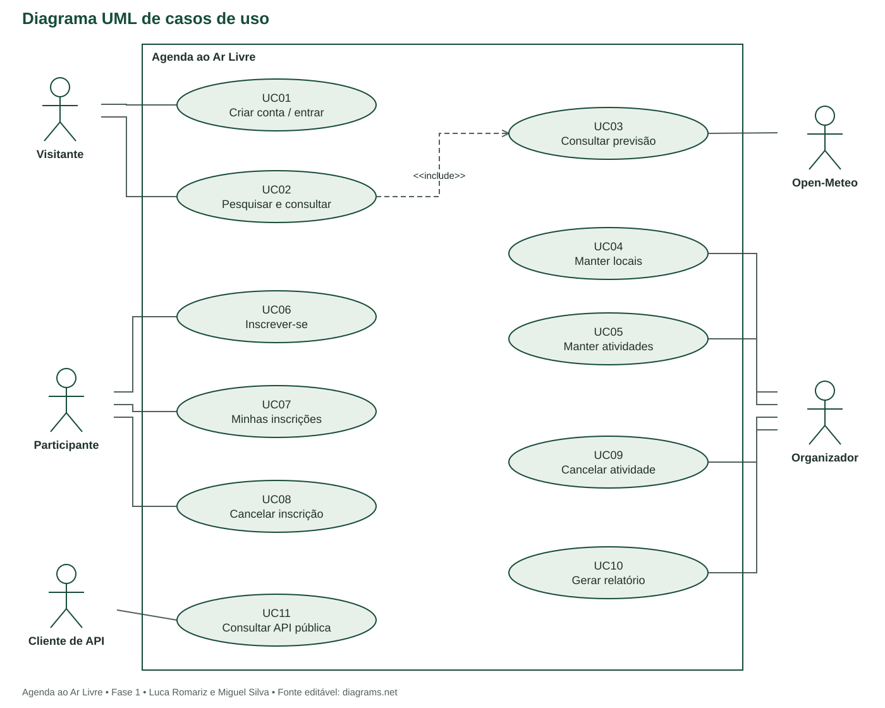

# Especificações de casos de uso
Agenda ao Ar Livre | Fase 1 | 04/10/2026

## Atores e convenções
Visitante consulta o catálogo e cria conta. Participante utiliza inscrições. Organizador mantém seus locais/atividades e relatórios. Participante e organizador são papéis simultâneos de uma conta. Open-Meteo é ator secundário; Cliente de API representa sistemas terceiros.

Autenticação é precondição dos fluxos protegidos, não um include repetido em cada operação. UC02 e UC11 incluem UC03 quando consultam o detalhe meteorológico (no caso da API, especificamente a rota de previsão). No diagrama, UC11 não possui include obrigatório, pois nem toda consulta de API pede previsão.

## Diagrama UML

Fonte editável: casos-de-uso.drawio. Elipses representam objetivos; linhas ligam atores; seta tracejada include indica comportamento obrigatório do detalhe UC02.

## UC01 - Criar conta e autenticar-se

**Atores:** Visitante / usuário. **Requisito:** RF01. **Prioridade:** alta.

**Objetivo:** Criar conta e autenticar-se no contexto do Agenda ao Ar Livre.

**Precondições:** Conta ativa para login; para cadastro, e-mail ainda não utilizado.

**Pós-condições de sucesso:** Conta criada e/ou sessão iniciada; logout invalida a sessão.

**Pós-condições de falha:** nenhuma alteração parcial; mensagens preservam dados de formulário quando aplicável.

### Fluxo principal
1. Informar nome, e-mail, senha e confirmação no cadastro.
2. Validar campos, normalizar e-mail e aplicar validadores de senha do Django.
3. Salvar conta com hash da senha e solicitar login.
4. Receber credenciais, validar conta ativa e iniciar sessão.
5. No logout, encerrar a sessão por POST com CSRF.

### Fluxos alternativos
- Cadastro repetido: informar impossibilidade de concluir e orientar login sem divulgar detalhes da conta.
- Credenciais incorretas: mensagem genérica; limitar tentativas a 5 por minuto por origem e identificador.

### Exceções
- Falha de persistência: rollback; não criar conta parcial.
- CSRF inválido em login/logout: rejeitar operação.

## UC02 - Pesquisar e consultar atividades

**Atores:** Visitante, participante e organizador. **Requisito:** RF04. **Prioridade:** alta.

**Objetivo:** Pesquisar e consultar atividades no contexto do Agenda ao Ar Livre.

**Precondições:** Aplicação disponível.

**Pós-condições de sucesso:** Lista ou detalhe público apresentado sem alteração de dados.

**Pós-condições de falha:** nenhuma alteração parcial; mensagens preservam dados de formulário quando aplicável.

### Fluxo principal
1. Informar texto, cidade, categoria e/ou datas de início.
2. Validar intervalo; buscar somente publicada/cancelada.
3. Paginar e ordenar por início e id.
4. Selecionar atividade e visualizar endereço, horário, situação e vagas.
5. Incluir UC03 para o bloco meteorológico do detalhe.

### Fluxos alternativos
- Sem resultados: oferecer limpeza dos filtros.
- Rascunho: só o dono acessa pela área de gestão; catálogo público retorna não encontrado.
- Evento cancelado: mostrar motivo e desabilitar inscrição.

### Exceções
- Período inválido: exibir erro e conservar filtros.
- Identificador ausente: retornar página não encontrada.

## UC03 - Consultar previsão

**Atores:** Visitante, participante e organizador; secundário: Open-Meteo. **Requisito:** RF08. **Prioridade:** alta.

**Objetivo:** Consultar previsão no contexto do Agenda ao Ar Livre.

**Precondições:** Atividade acessível, local com coordenadas válidas.

**Pós-condições de sucesso:** Previsão diária ou estado de indisponibilidade apresentado; atividade inalterada.

**Pós-condições de falha:** nenhuma alteração parcial; mensagens preservam dados de formulário quando aplicável.

### Fluxo principal
1. Converter início para data local America/Sao_Paulo.
2. Verificar horizonte e procurar cache por coordenadas/data/fuso.
3. Na ausência de cache válido, consultar Open-Meteo pelo backend.
4. Validar estrutura JSON, unidades, data e valores; normalizar resposta.
5. Exibir mínima, máxima, probabilidade máxima de precipitação, código traduzido, fonte e instante da consulta.

### Fluxos alternativos
- Fora do horizonte: mostrar fora_do_horizonte sem solicitar API.
- Cache válido: reutilizar por até 30 minutos.
- Dado parcial/nulo: apresentar indisponivel sem preencher valores fictícios.

### Exceções
- Timeout, HTTP 429, 5xx ou JSON inválido: retornar indisponivel, mantendo detalhe e inscrição.
- Registrar categoria de falha sem dados pessoais; não repetir imediatamente chamadas com erro.

## UC04 - Manter locais

**Atores:** Organizador. **Requisito:** RF02. **Prioridade:** alta.

**Objetivo:** Manter locais no contexto do Agenda ao Ar Livre.

**Precondições:** Sessão ativa; para alterar/excluir, ser dono do local.

**Pós-condições de sucesso:** Local salvo, consultado ou excluído segundo restrições.

**Pós-condições de falha:** nenhuma alteração parcial; mensagens preservam dados de formulário quando aplicável.

### Fluxo principal
1. Abrir lista dos próprios locais e solicitar criação.
2. Informar nome, endereço, cidade, UF, latitude e longitude.
3. Validar campos, limites das coordenadas e contexto de fuso do projeto.
4. Salvar com proprietário extraído da sessão.
5. Permitir edição ou exclusão após verificar referências.

### Fluxos alternativos
- Editar: endereço/coordenadas bloqueados quando há atividade publicada ou histórico de inscrição.
- Excluir: permitido apenas sem atividades relacionadas.

### Exceções
- Dados inválidos: não salvar e destacar campos.
- Local de outro usuário: negar acesso; referência existente impede exclusão.

## UC05 - Manter e publicar atividades

**Atores:** Organizador. **Requisito:** RF03. **Prioridade:** alta.

**Objetivo:** Manter e publicar atividades no contexto do Agenda ao Ar Livre.

**Precondições:** Sessão ativa e local próprio; categorias previamente cadastradas pela administração.

**Pós-condições de sucesso:** Rascunho salvo, atividade publicada/editada ou rascunho elegível excluído.

**Pós-condições de falha:** nenhuma alteração parcial; mensagens preservam dados de formulário quando aplicável.

### Fluxo principal
1. Abrir formulário e informar título, descrição, local, categoria, início, término e capacidade.
2. Validar RN01-RN04; salvar rascunho.
3. Revisar e solicitar publicação.
4. Publicar e tornar atividade visível no catálogo.
5. Para edição/exclusão, verificar dono, situação, horário e histórico sob bloqueio transacional.

### Fluxos alternativos
- Capacidade menor que confirmados: recusar.
- Histórico de inscrição: bloquear mudança de local, categoria e horários.
- Excluir rascunho sem inscrições: confirmar e excluir; atividade publicada deve usar UC09.

### Exceções
- Falha de banco: rollback.
- Acesso por não dono ou operação após início: negar alteração.

## UC06 - Inscrever-se

**Atores:** Participante. **Requisito:** RF05. **Prioridade:** alta.

**Objetivo:** Inscrever-se no contexto do Agenda ao Ar Livre.

**Precondições:** Sessão ativa; atividade publicada, futura e de outro organizador.

**Pós-condições de sucesso:** Uma inscrição confirmada existe e ocupa uma vaga.

**Pós-condições de falha:** nenhuma alteração parcial; mensagens preservam dados de formulário quando aplicável.

### Fluxo principal
1. Solicitar inscrição no detalhe.
2. Bloquear linha da atividade em transação.
3. Revalidar situação, início, capacidade e inscrição existente.
4. Criar inscrição ou reativar a cancelada, se houver vaga.
5. Confirmar transação e exibir sucesso e vagas atualizadas.

### Fluxos alternativos
- Já confirmada: informar inscrição existente sem duplicar.
- Sem vagas: informar lotação.
- Conta do organizador: recusar autoinscrição.

### Exceções
- Concorrência: a segunda requisição vê contagem atualizada após o bloqueio.
- Falha de banco: rollback sem consumir vaga.

## UC07 - Consultar minhas inscrições

**Atores:** Participante. **Requisito:** RF06. **Prioridade:** alta.

**Objetivo:** Consultar minhas inscrições no contexto do Agenda ao Ar Livre.

**Precondições:** Sessão ativa.

**Pós-condições de sucesso:** Lista restrita ao usuário apresentada.

**Pós-condições de falha:** nenhuma alteração parcial; mensagens preservam dados de formulário quando aplicável.

### Fluxo principal
1. Abrir Minhas inscrições.
2. Buscar somente registros do usuário autenticado.
3. Mostrar título, data, situação e motivo de cancelamento quando houver.
4. Oferecer detalhe e cancelamento se elegível.

### Fluxos alternativos
- Sem inscrições: apresentar orientação e acesso ao catálogo.

### Exceções
- Sessão expirada: solicitar login.
- Não aceitar id de outro participante como filtro.

## UC08 - Cancelar inscrição

**Atores:** Participante. **Requisito:** RF06. **Prioridade:** alta.

**Objetivo:** Cancelar inscrição no contexto do Agenda ao Ar Livre.

**Precondições:** Ser dono da inscrição; atividade ainda não iniciada.

**Pós-condições de sucesso:** Inscrição cancelada pelo participante; vaga liberada se antes confirmada.

**Pós-condições de falha:** nenhuma alteração parcial; mensagens preservam dados de formulário quando aplicável.

### Fluxo principal
1. Solicitar cancelamento e confirmar intenção.
2. Bloquear atividade e localizar inscrição do usuário na transação.
3. Se confirmada e elegível, mudar para cancelada com motivo participante.
4. Salvar cancelada_em e atualizar interface.

### Fluxos alternativos
- Já cancelada: informar situação sem liberar vaga novamente.
- Atividade cancelada: manter motivo existente.

### Exceções
- Atividade já iniciada: recusar operação.
- Registro de outro usuário: negar acesso.

## UC09 - Cancelar atividade

**Atores:** Organizador. **Requisito:** RF07. **Prioridade:** alta.

**Objetivo:** Cancelar atividade no contexto do Agenda ao Ar Livre.

**Precondições:** Ser dono; atividade publicada e futura.

**Pós-condições de sucesso:** Atividade cancelada e inscrições confirmadas canceladas atomicamente.

**Pós-condições de falha:** nenhuma alteração parcial; mensagens preservam dados de formulário quando aplicável.

### Fluxo principal
1. Solicitar cancelamento na gestão.
2. Informar motivo de 10 a 500 caracteres e confirmar.
3. Bloquear atividade, revalidar dono e início.
4. Salvar situação, motivo e cancelada_em; cancelar inscrições confirmadas com motivo atividade_cancelada.
5. Confirmar transação; exibir informação pública e em Minhas inscrições.

### Fluxos alternativos
- Já cancelada: manter resultado anterior sem nova alteração.

### Exceções
- Motivo inválido: não salvar.
- Falha ao atualizar inscrições: reverter toda a transação.

## UC10 - Gerar e exportar relatório

**Atores:** Organizador. **Requisito:** RF09. **Prioridade:** alta.

**Objetivo:** Gerar e exportar relatório no contexto do Agenda ao Ar Livre.

**Precondições:** Sessão ativa; filtros válidos.

**Pós-condições de sucesso:** Indicadores exibidos e CSV equivalente disponível.

**Pós-condições de falha:** nenhuma alteração parcial; mensagens preservam dados de formulário quando aplicável.

### Fluxo principal
1. Informar intervalo inclusivo de datas de início e situação opcional.
2. Filtrar somente atividades do organizador.
3. Agrupar inscrições únicas atuais por confirmada/cancelada.
4. Exibir totais de atividades, publicadas, canceladas, inscrições e ocupação.
5. Solicitar CSV, usando os mesmos filtros e regras de acesso.

### Fluxos alternativos
- Sem registros: apresentar zeros, ocupação nula e CSV só com cabeçalho.

### Exceções
- Intervalo invertido: recusar e indicar campos.
- Sessão expirada: solicitar autenticação; nunca gerar relatório global.

## UC11 - Consultar API pública

**Atores:** Cliente de API (terceiro). **Requisito:** RF10. **Prioridade:** alta.

**Objetivo:** Consultar API pública no contexto do Agenda ao Ar Livre.

**Precondições:** Requisição HTTP para rota v1 documentada.

**Pós-condições de sucesso:** JSON público ou erro HTTP padronizado retornado.

**Pós-condições de falha:** nenhuma alteração parcial; mensagens preservam dados de formulário quando aplicável.

### Fluxo principal
1. Enviar GET ao catálogo com filtros opcionais.
2. Validar parâmetros e aplicar limite de requisições.
3. Consultar os mesmos serviços de leitura usados pela interface.
4. Retornar JSON paginado com status 200; detalhe e previsão usam id da atividade.

### Fluxos alternativos
- GET categorias: listar catálogo de categorias.
- GET previsão: executar UC03; indisponibilidade é estado do recurso com HTTP 200.
- Rascunho: retornar 404.

### Exceções
- Parâmetro inválido: 400; rota/id inexistente: 404; método não permitido: 405.
- Limite excedido: 429 com Retry-After; falha interna: 500 sem detalhes sensíveis.
