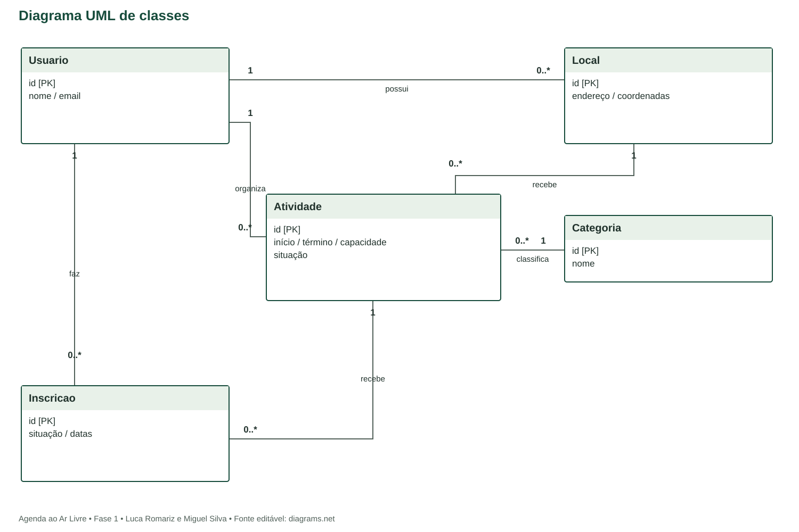

# Diagrama de classes
Agenda ao Ar Livre | Modelo estrutural proposto

Fonte editável: diagrama-de-classes.drawio.

## Responsabilidades
Usuario representa identidade; Local descreve um espaço sob gestão de um organizador; Categoria classifica a atividade; Atividade concentra situação, período e capacidade; Inscricao resolve o vínculo entre participante e atividade.

Operações inscrever, cancelar e publicar ficam em serviços transacionais, e não em controllers duplicados. Relatório e previsão são resultados derivados e não entidades persistidas de negócio. O cache meteorológico é infraestrutura.

## Multiplicidades
Um Usuario possui 0..* locais e organiza 0..* atividades; cada local e atividade tem exatamente 1 dono. Um Local recebe 0..* atividades; cada atividade ocorre em 1 local. Uma Categoria classifica 0..* atividades; cada atividade tem 1 categoria. Um Usuario possui 0..* inscrições; cada inscrição pertence a 1 usuário e 1 atividade; uma atividade possui 0..* inscrições.

## Integridade
Inscricao é única pelo par usuario_id/atividade_id. Capacidade não é lista de inscrições: vagas são calculadas. Relações não usam composição UML, pois a exclusão de objetos com histórico é protegida.
