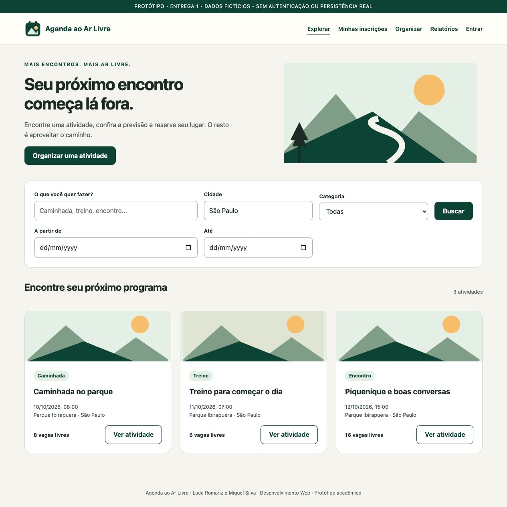
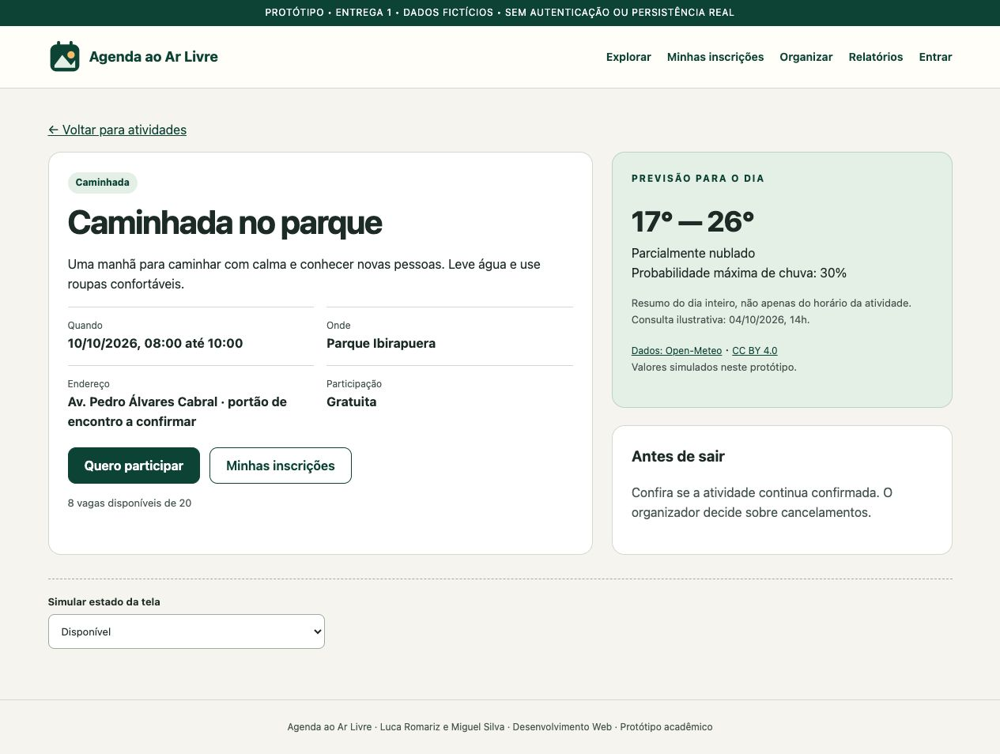
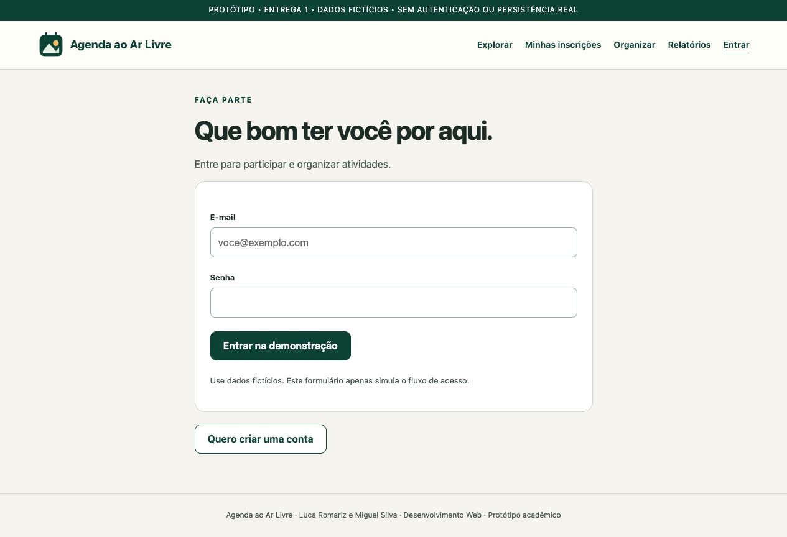
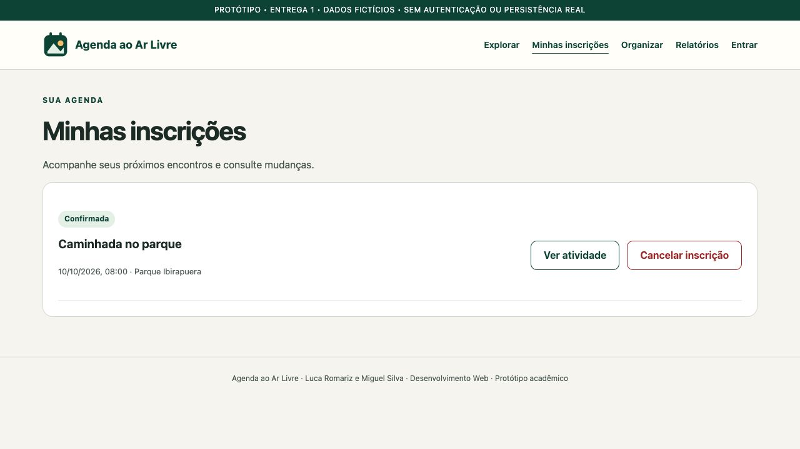
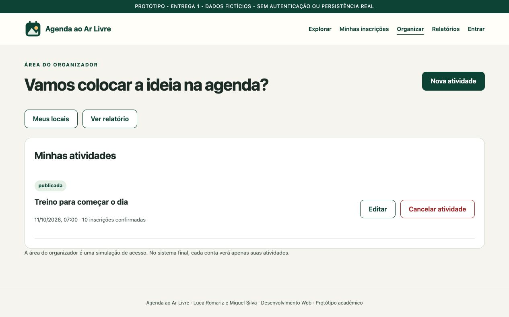
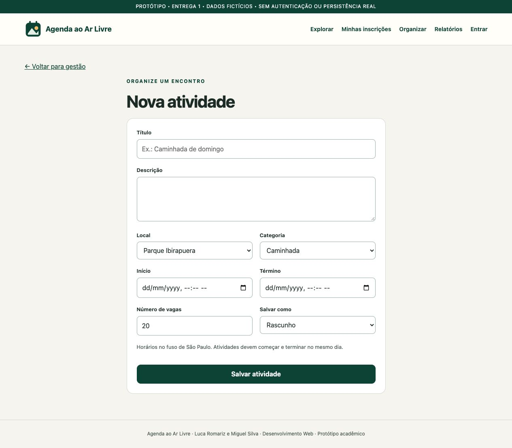
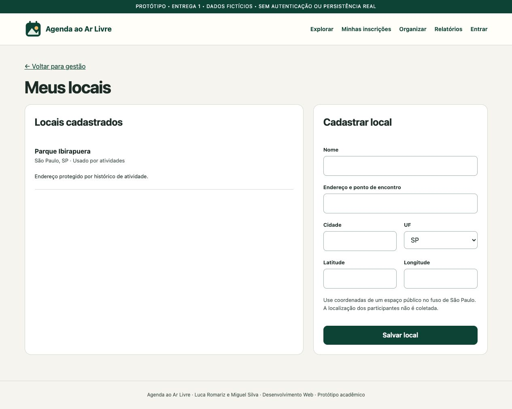
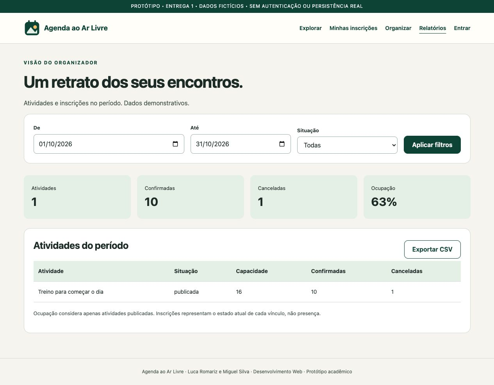

# Galeria dos protótipos

Agenda ao Ar Livre — Entrega 1. Capturas com dados fictícios; não representam a aplicação implementada.

Fontes editáveis: [HTML](index.html), [CSS](styles.css) e [JavaScript](app.js).

## 1. Explorar atividades

## 2. Detalhe e previsão

## 3. Acesso

## 4. Minhas inscrições

## 5. Organização

## 6. Cadastro de atividade

## 7. Locais

## 8. Relatórios

